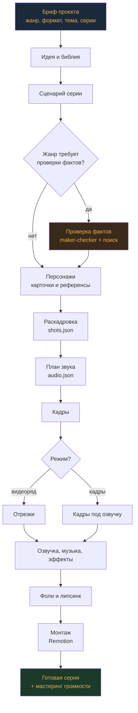
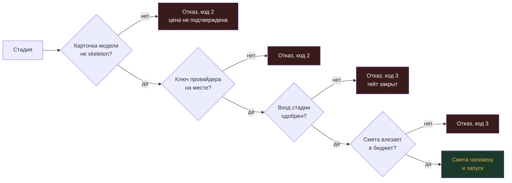
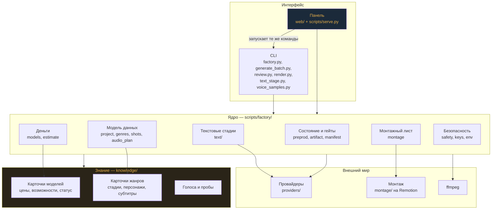

# Архитектура

## Поток работы: от брифа до готовой серии

Текстовые стадии (белые) бесплатны для провайдеров видео; платит только тот, у
кого движок текста — модель по ключу. Стадии генерации медиа платные, и перед
каждой показывается смета.

## Гейты: где конвейер останавливается сам

Ни один отказ не тратит денег: все проверки идут до первого запроса провайдеру.

## Слои кода

## Правила, на которых всё держится

**Панель не дублирует логику конвейера.** Она запускает те же команды, что
человек в терминале, и читает то же состояние. На каждый вопрос — «можно ли
тратить», «какая модель годится», «пройдена ли проверка фактов», «с какой
громкостью звучит дорожка» — отвечает ровно одна функция. Два ответа об одном
состоянии разошлись бы в первый же день.

**Знание — данные, а не код.** Цена модели, её возможности и статус живут в
карточке `knowledge/`; какие стадии есть у жанра — в карточке жанра. Добавить
модель или жанр значит положить файл, а не править ветвления.

**Изоляция провайдера.** Точные эндпоинты, имена полей и идентификаторы моделей
каждого провайдера живут только в его адаптере и его контракте в `knowledge/`.
Ключи читаются из окружения.

**Python отдаёт намерение, монтаж выясняет факты.** В монтажном листе нет ни
одной длительности: какие файлы, в каком порядке и с какой громкостью — от
Python; сколько они длятся — измеряет Remotion. Две стороны, читающие одни файлы
разными способами, однажды разойдутся в ответе.

**Деньги под контролем.** Карточка со статусом `skeleton` блокирует трату:
цена и возможности не подтверждены живой генерацией. Смета показывается до
траты и считается одной функцией — той же, что показывает цену при выборе
модели. У проекта есть потолок бюджета.

**Данные, которые пишет модель, не становятся путями без проверки.** Имя
персонажа, идентификатор реплики, ссылка на референс — всё проходит проверку на
пригодность как имя файла и на выход за пределы проекта.
