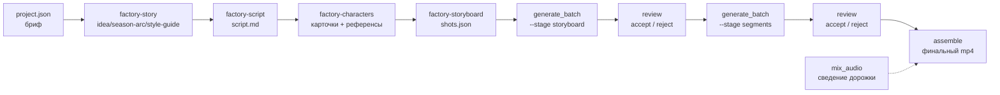

# content-factory

ИИ-конвейер создания видео: от брифа до готовой серии со звуком.

Кадры и видеоотрезки генерируются внешними провайдерами (**WaveSpeed**, **Runware**, **OpenRouter**),
ревью и сборка — локально. Провайдер, модель, тир и разрешение задаются в `project.json`,
код провайдеро-нейтрален: точные эндпоинты и model-id живут только в адаптере и его knowledge-доке.

> **Статус: рабочий прототип, не продукт.** Пайплайн доказан на живых генерациях, но часть
> маппингов провайдеров ещё не подтверждена, а генерация звука вынесена наружу — см.
> [Ограничения](#ограничения).

## Как работает



Левая половина (`project.json` → `shots.json`) — пре-продакшн: гейты и состояние
пишет `scripts/factory.py`, творческую часть в каждом узле выполняет одноимённый
скилл `.claude/skills/factory-*`, см. раздел [Пре-продакшн](#пре-продакшн-от-брифа-до-shotsjson)
ниже. Правая половина (от `shots.json`) — генерация и сборка, описана дальше в этом файле.

Каждая генерация — item в `manifest.json` со статусом. Отрезки нельзя генерировать, пока
кадры не приняты ревью; собрать эпизод нельзя, пока не приняты отрезки. Гейты возвращают
ненулевой код выхода, а не молча пропускают шаг.

Статусы item: `pending` → `generated` → `done` | `accepted_with_notes` | `rejected`.
`requeue` возвращает `rejected` / `accepted_with_notes` обратно в `pending`
(счётчик отклонений при этом не сбрасывается — это журнал).

## Установка

Нужны Python 3.12+ и ffmpeg в `PATH`.

```bash
python -m venv .venv
.venv/Scripts/python -m pip install -r requirements.txt
```

Зависимости минимальны: `pytest`, `pyyaml`. HTTP-вызовы — на `urllib` из стандартной библиотеки,
внешнего SDK нет.

**Все скрипты запускаются из корня репозитория** — пути `knowledge/` и `projects/` относительные.

## Ключи провайдеров

Читаются только из окружения, в коде и конфигах не хранятся:

```
WAVESPEED_API_KEY
RUNWARE_API_KEY
OPENROUTER_API_KEY
```

Нужен только ключ того провайдера, который выбран в проекте. Отсутствующий ключ —
явная ошибка до начала трат.

## Конфигурация проекта

`projects/<name>/project.json`:

```json
{
  "name": "pilot",
  "type": "animated_series",
  "theme": "space cats",
  "audience": "6-9",
  "episodes": 1,
  "episode_duration_sec": 10,
  "resolution": "720p",
  "models": {
    "image": {"model": "flux_2_klein", "provider": "wavespeed"},
    "video": {"model": "vidu_q2_turbo", "provider": "wavespeed", "tier": "std"}
  }
}
```

`models.image` / `models.video` принимают либо строку (`"flux_2_klein"`), либо объект
`{model, provider?, tier?}`. Если провайдер не указан, берётся дефолт по типу контента:

| `type` | обязательные поля | провайдер по умолчанию |
|---|---|---|
| `film` | `duration_sec`, `theme` | `wavespeed` |
| `series` | `theme`, `episodes`, `episode_duration_sec` | `wavespeed` |
| `shorts` | `duration_sec`, `theme` | `wavespeed` |
| `animated_film` | `duration_sec`, `theme`, `audience` | `runware` |
| `animated_series` | `theme`, `audience`, `episodes`, `episode_duration_sec` | `runware` |

`resolution` задаётся на верхнем уровне или в `models.video`, по умолчанию `720p`.
Для `shorts` соотношение сторон — 9:16, для остальных типов — 16:9.

Покадровый план эпизода — `projects/<name>/episodes/<ep>/shots.json`. Пишет его
`/factory-storyboard` (см. ниже); промпты кадров содержат плейсхолдеры `{{style}}` и
`{{char:<имя>}}` вместо копий канонических блоков — их разворачивает код перед сабмитом:

```json
{
  "episode": "ep01",
  "frames": [
    {"n": 1, "prompt": "{{style}} {{char:murzik}} in a spaceship corridor",
     "refs": ["bible/characters/murzik-ref.png"]},
    {"n": 2, "prompt": "{{style}} {{char:murzik}} presses a red button, same camera angle",
     "refs": ["bible/characters/murzik-ref.png", "episodes/ep01/storyboard/001.png"]}
  ],
  "segments": [
    {"n": 1, "start_frame": 1, "end_frame": 2,
     "prompt": "the cat reaches out and presses the button, static camera"}
  ]
}
```

Отрезок интерполируется между двумя уже принятыми кадрами, поэтому консистентность
держится кадрами, а не только промптом. `refs` — пути относительно папки проекта.
`{{style}}` подставляет блок `canonical:style` из `bible/style-guide.md`, `{{char:<имя>}}` —
блок `canonical:appearance` из `bible/characters/<имя>.md`; развёрнутый текст,
фактически отправленный провайдеру, пишется в `manifest.json` полем `prompt_sent`.
Промпты отрезков (`segments`) плейсхолдеры не разворачивают — там пишется обычный текст.

## Пре-продакшн: от брифа до shots.json

Путь «бриф → `shots.json`» — не ручной: механику (состояние артефактов, гейты,
одобрение) ведёт `scripts/factory.py`, творческую часть каждого этапа — скиллы
`.claude/skills/factory-*`. Полный дизайн — [`docs/superpowers/specs/2026-08-02-preproduction-pipeline-design.md`](docs/superpowers/specs/2026-08-02-preproduction-pipeline-design.md).

Дерево артефактов проекта:

```
projects/<name>/
├── project.json              бриф, модели, режим автономности, бюджет
├── research.md                опционально — веб-исследование темы
├── bible/
│   ├── idea.md                идея + общая стилистика
│   ├── season-arc.md          сквозной сюжет на все серии
│   ├── style-guide.md         канонический блок визуального стиля (canonical:style)
│   ├── craft-notes.md         свод правил по ремеслу, читается каждой творческой стадией
│   └── characters/
│       ├── <name>.md          характер, канонический блок внешности (canonical:appearance), голос
│       └── <name>-ref.png     утверждённый референс
└── episodes/<ep>/
    ├── script.md               сценарий, разбитый на биты; frontmatter объявляет characters: [...]
    └── shots.json               план съёмки с плейсхолдерами (пишет /factory-storyboard)
```

Каждый текстовый артефакт (`idea.md`, `season-arc.md`, `style-guide.md`, карточки
персонажей, `script.md`, `research.md`) несёт YAML-frontmatter с `kind`, `status`
(`draft` до одобрения человеком, `approved` — только после `factory.py approve`),
и, после одобрения, `content_sha` + `depends_on` (хеши, по которым правка одобренного
файла или его основания заметна гейту). `shots.json` — обычный JSON без frontmatter,
через этот механизм не проходит.

Состояние артефакта (`factory.py status`/`factory.py check` используют одно и то же):

| состояние | значит |
|---|---|
| `missing` | файла нет |
| `broken` | файл есть, но не читается (битый frontmatter) |
| `draft` | написан, не одобрен |
| `approved` | одобрен, тело и зависимости не менялись с момента одобрения |
| `stale_self` | одобрен, но тело поправили после одобрения |
| `stale_deps` | сам не менялся, но изменилось то, от чего он зависит |

CLI:

```bash
python scripts/factory.py init     --project projects/pilot   # скаффолд дерева
python scripts/factory.py status   --project projects/pilot   # артефакт → состояние → feedback
python scripts/factory.py next     --project projects/pilot   # первый незакрытый шаг
python scripts/factory.py check    --project projects/pilot --stage script --episode ep01
python scripts/factory.py approve  --project projects/pilot bible/idea.md   # ЕДИНСТВЕННОЕ место, где появляется status: approved
python scripts/factory.py feedback --project projects/pilot bible/idea.md --state recorded
python scripts/factory.py diff     --project projects/pilot bible/idea.md   # что человек поправил с момента коммита
python scripts/factory.py budget   --project projects/pilot --estimate 3.0  # потолок budget_usd при autonomy: full
```

Коды выхода `factory.py`: 0 успех, 1 ошибка данных, 3 гейт закрыт (в т.ч. потолок
`budget_usd`). Путь к артефакту в этих командах — относительно папки проекта
(`bible/idea.md`), а не от корня репозитория.

Скиллы, по этапу:

| скилл | этап | чекпоинт |
|---|---|---|
| `/factory-research` | 2, необязательный — настоящий веб-поиск по теме | нет |
| `/factory-story` | 3 — idea/season-arc/style-guide | да |
| `/factory-script` | 4 — script.md серии | да |
| `/factory-characters` | 5 — карточки персонажей + референсы (единственные деньги первой половины) | да |
| `/factory-storyboard` | 6 — shots.json с плейсхолдерами | нет (дальше гейт трат) |
| `/factory` | драйвер — идёт по `factory.py next` через все эпизоды по порядку | по `project.json.autonomy` |
| `/factory-feedback` | разбор правок пользователя → правила в `bible/craft-notes.md` | — |

Режим автономности (`project.json.autonomy`, дефолт `checkpoints`):

| autonomy | на чекпоинте |
|---|---|
| `checkpoints` | остановиться, показать дайджест, ждать `factory.py approve` от человека |
| `auto_approve` | одобрить текст самостоятельно, идти дальше |
| `full` | то же плюс тратить на генерации без вопроса, не превышая `budget_usd` |

## Команды

```bash
# генерация кадров, затем — после ревью — отрезков
python scripts/generate_batch.py --project projects/pilot --episode ep01 --stage storyboard
python scripts/generate_batch.py --project projects/pilot --episode ep01 --stage segments

# ревью
python scripts/review.py --project projects/pilot list --status generated
python scripts/review.py --project projects/pilot accept ep01/storyboard/001
python scripts/review.py --project projects/pilot accept-notes ep01/storyboard/002 --notes "..."
python scripts/review.py --project projects/pilot reject ep01/segments/001 --reason "..."
python scripts/review.py --project projects/pilot requeue ep01/segments/001

# звук и сборка
python scripts/mix_audio.py --project projects/pilot --episode ep01
python scripts/assemble.py --project projects/pilot --episode ep01
```

`generate_batch` показывает смету до трат и ждёт подтверждения; `--yes` пропускает вопрос
(для автоматизации).

Коды выхода:

| код | `generate_batch` | `mix_audio` | `assemble` |
|---|---|---|---|
| 0 | успех | успех (или пустой `audio.json` — файл не создаётся) | успех |
| 1 | сбой или отмена | ошибка данных / ffmpeg | ошибка данных / ffmpeg |
| 2 | модель не прошла валидацию | — | — |
| 3 | `segments` заблокирован: кадры не приняты | аудио не принято ревью | отрезки не приняты |

`assemble` собирает видео и без звука, если `audio/mix.m4a` ещё нет. Длительность
сверяется с планом, допуск ±5% — при выходе за него печатается предупреждение,
но файл сохраняется.

## Карточки моделей и гейт трат

`knowledge/<video|images|audio>/<model>.md` — по карточке на модель: возможности, цены,
best practices и frontmatter-блок `providers:` с маппингом на конкретных провайдеров.

Ключевое поле — `status`:

- `skeleton` — маппинг не подтверждён живой генерацией. **Генерация блокируется** (код 2)
  до того, как деньги будут потрачены.
- `verified` — маппинг проверен живым вызовом, в комментарии зафиксированы дата,
  фактическое разрешение файла и списанная сумма.

Смета считается из `providers`-блока (`estimate_media_cost`): flat — $/с, scaled —
база 720p × множитель разрешения, image — $/изображение. Цены в прозе карточек не
дублируются, чтобы не расходились с реальностью.

## Структура

```
scripts/
  factory.py           CLI пре-продакшна: status/next/check/approve/feedback/diff/budget
  generate_batch.py     батч-генерация референсов персонажей, кадров и отрезков
  review.py             CLI ревью (accept / accept-notes / reject / requeue)
  mix_audio.py          сведение дорожки эпизода (ducking музыки под реплики)
  assemble.py           склейка финального mp4 (+звук, если сведён)
  factory/
    artifact.py        YAML-frontmatter артефакта + content_sha (пре-продакшн)
    preprod.py         состояние артефактов, гейты, next_stage (пре-продакшн)
    prompts.py         плейсхолдеры {{style}}/{{char:...}} и их разворачивание
    project.py         разбор project.json, дефолты провайдеров
    manifest.py        статусы генераций
    models.py          карточки, валидация модели, смета
    shots.py           пути кадров и отрезков
    audio_plan.py      план audio.json (voice_lines / music_cues / sfx)
    ffmpeg_tools.py    обёртки ffmpeg / ffprobe
    providers/         base + wavespeed / runware / openrouter, фабрика get_provider
.claude/skills/        скиллы пре-продакшна: factory (драйвер), factory-research,
                       factory-story, factory-script, factory-characters,
                       factory-storyboard, factory-feedback
knowledge/             карточки моделей и контракты API провайдеров
projects/              контент-проекты (project.json, manifest.json, bible/, episodes/)
docs/                  спеки, планы, исследование рынка моделей
tests/                 pytest
```

## Тесты

```bash
.venv/Scripts/python -m pytest -q
```

Живые вызовы провайдеров в тестах замоканы — набор гоняется без ключей и без трат.

## Ограничения

- **Генерация звука не входит в конвейер.** Стадия `audio` удалена: TTS через Higgsfield
  не заработал, озвучка вынесена в отдельную задачу на ElevenLabs. Фаза звука отложена
  пользователем 2026-08-01: провайдер TTS не выбран, провайдер SFX/музыки не выбран,
  контракт ElevenLabs не исследован — старт с отдельного захода `superpowers:brainstorming`.
  `mix_audio` и `assemble` реализованы и ждут готовые аудиофайлы, прописанные в манифесте.
- **Живьём подтверждены 10 из 19 карточек** кадров/отрезков — 5 image (`flux_2_klein`,
  `nano_banana_2`, `nano_banana_flash`, `seedream_v4_5`, `z_image_turbo`) и 5 video
  (`kling3_0`, `seedance1_5`, `seedance_2_0`, `veo3_1_lite`, `vidu_q2_turbo`). Остальные
  9 карточек (`grok_image`, `seedream_v5_lite`, `grok_video`, `grok_video_v15`, `kling2_6`,
  `minimax_hailuo`, `veo3`, `veo3_1`, `wan2_7`) — `status: skeleton`, генерация по ним
  заблокирована гейтом (код 2) до живой проверки.
- **Runware подтверждён живьём для двух карточек** — `flux_2_klein` (image) и
  `vidu_q2_turbo` (video). Там, где в карточке есть Runware-маппинг, но живой проверки не
  было (`kling3_0`, `seedance_2_0`), это отмечено прямо в `status`-комментарии карточки.
- **OpenRouter не тронут в этой итерации** — верифицирована живьём только одна карточка
  (`veo3_1_lite`, 2026-06-17), маппинги остальных карточек на OpenRouter не проверялись.
- **1080p не проверено живой генерацией ни у одной видео-модели** — все живые пробы этой
  итерации прошли на 720p; `1080p` для Runware намеренно не замаплен (шаг не кратен 16 —
  см. `knowledge/runware-api.md`).
- **Ключи провайдеров** (`WAVESPEED_API_KEY`, `RUNWARE_API_KEY`, `OPENROUTER_API_KEY`)
  засветились в чате 2026-06-17 и до сих пор не перевыпущены.
- **Пре-продакшн (бриф → `shots.json`) не прогонялся живьём end-to-end.** Гейты и
  состояние покрыты 320 тестами `pytest`, но ни один реальный проект не прошёл через
  `/factory-story` → `/factory-script` → `/factory-characters` → `/factory-storyboard`
  целиком — первая живая проверка будет уже платной (референсы персонажей на этапе 5).
- Автоматическая пометка «одобрено машиной» для `autonomy: auto_approve`/`full` (спека
  §7) не реализована: `scripts/factory.py approve` не принимает флага на это, `approved_at`
  у автоматического и ручного одобрения получается одинаковым — отличить можно только по
  журналу git-коммитов сессии.
- **Пилот** (мини-серия 60–90 сек, спека §14) не пройден — реальный процент брака и
  стоимость серии не замерены.

## Документация

- [`docs/superpowers/specs/2026-06-11-content-factory-design.md`](docs/superpowers/specs/2026-06-11-content-factory-design.md) — базовая спека конвейера
- [`docs/superpowers/specs/2026-06-15-provider-refactor-design.md`](docs/superpowers/specs/2026-06-15-provider-refactor-design.md) — дизайн слоя провайдеров
- [`docs/superpowers/specs/2026-08-02-preproduction-pipeline-design.md`](docs/superpowers/specs/2026-08-02-preproduction-pipeline-design.md) — дизайн пре-продакшна (бриф → shots.json), гейты и скиллы
- [`docs/superpowers/plans/2026-07-08-roadmap-next-steps.md`](docs/superpowers/plans/2026-07-08-roadmap-next-steps.md) — актуальный роадмап
- [`docs/video-stack-FINAL-2026-06-14.md`](docs/video-stack-FINAL-2026-06-14.md) — выбор моделей и экономика
